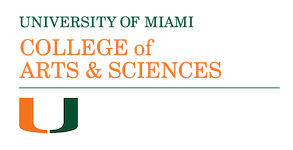
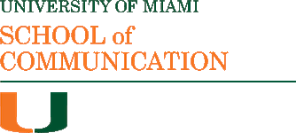
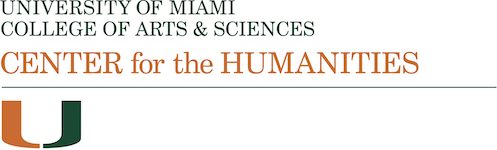
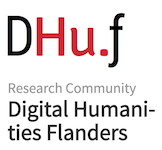

## Welcome 

Computer-Assisted Text Analysis for Resource-Scare Literatures (CARTARSL) will be held on 
April 24-25, 2019 at the University of Miami, FL 

This two-day symposium aims to bring together scholars and researchers working with computational approaches to texts. The event targets a broad audience interested in the application of digital text analysis technology (text mining, topic modeling, authorship detection, tasks performed through Natural Language Processing) for Resource-Scare Literatures and from an historical perspective. Come join us! 

## Important dates: 
- January 20, 2019: Deadline for the submission of abstracts 
- February 10, 2019: Notification of acceptance
- 24-25 April: Symposium

## Where 

  - April 24 from 9AM-2PM - [Newman Alumni Center Executive Boardroom](https://www.google.com/maps/place/Newman+Alumni+Center,+6200+San+Amaro+Dr,+Coral+Gables,+FL+33146/@25.7114757,-80.2858883,17z/data=!3m1!4b1!4m5!3m4!1s0x88d9c7f942144105:0x517a3c76081d14d!8m2!3d25.7114757!4d-80.2836996)
  - April 24 from 2PM-5PM – [Richter Library 3rd Floor Conference Room](https://www.google.com/maps/place/University+of+Miami+Richter+Library/@25.721262,-80.27865,15z/data=!4m2!3m1!1s0x0:0x9a1fae2d87d9c44a?ved=2ahUKEwiv9Zfr0qTgAhVSx1kKHUfSAFMQ_BIwCnoECAYQCA)
  - April 25 from 9AM-5PM – [Newman Alumni Center Executive Boardroom](https://www.google.com/maps/place/Newman+Alumni+Center,+6200+San+Amaro+Dr,+Coral+Gables,+FL+33146/@25.7114757,-80.2858883,17z/data=!3m1!4b1!4m5!3m4!1s0x88d9c7f942144105:0x517a3c76081d14d!8m2!3d25.7114757!4d-80.2836996)
                
Program will be shortly available [here](/SymposiumTextAnalysis/program/) as well as [Registration]()

More information about how to travel [here](/SymposiumTextAnalysis/travel/)

Sponsors: 

 

 

 

 

 